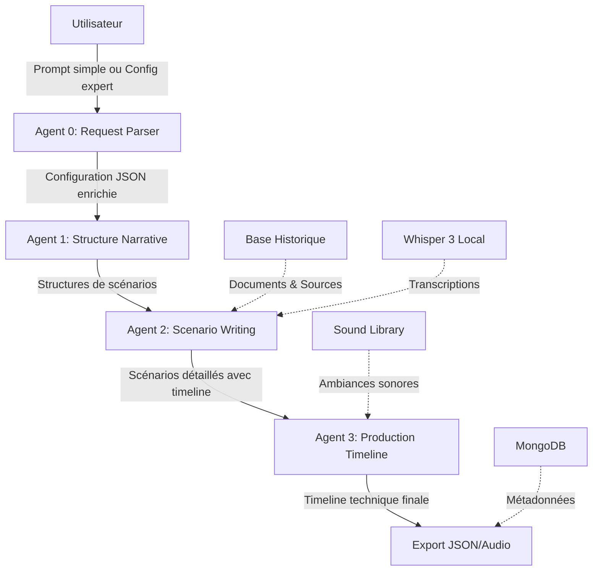

# 🎙️ Mémoire des Territoires - Générateur d'Archives Sonores

> Système de génération automatique d'archives audio historiques enrichies utilisant Claude SDK et l'IA pour créer des documentaires immersifs sur l'histoire des territoires et leurs mémoires collectives.

[](https://www.python.org/downloads/)
[](https://github.com/anthropics/anthropic-sdk-python)
[](LICENSE)

---

## 📋 Table des Matières

- [Vue d'ensemble](#-vue-densemble)
- [Fonctionnalités](#-fonctionnalités)
- [Architecture](#-architecture)
- [Installation](#-installation)
- [Configuration](#-configuration)
- [Utilisation](#-utilisation)
- [Modes d'utilisation](#-modes-dutilisation)
- [Structure du projet](#-structure-du-projet)
- [Agents](#-agents)
- [Contribution](#-contribution)
- [Licence](#-licence)

---

## 🎯 Vue d'ensemble

Ce projet génère automatiquement des **archives audio historiques** enrichies et immersives sur des territoires et événements historiques. Il combine :

- 🤖 **Intelligence artificielle** (Claude SDK) pour la création narrative
- 🎵 **Ambiances sonores authentiques** d'époque
- 📚 **Documents historiques validés** comme sources
- 🗣️ **Transcription audio** (Whisper 3) de témoignages d'archives
- 🎬 **Timeline de production** précise pour le montage audio final

### 🌍 Adaptable à tous territoires

Le système est **générique et adaptable** à n'importe quel territoire, période historique ou thématique :
- 🏭 **Patrimoine industriel** : usines, chantiers, manufactures
- 🌊 **Zones côtières** : ports, pêche, marine marchande
- 🏘️ **Quartiers urbains** : évolution des villes, vie quotidienne
- 🌾 **Territoires ruraux** : agriculture, traditions, folklore
- ⚔️ **Événements historiques** : guerres, révolutions, mouvements sociaux

> **Note** : Les exemples fournis dans cette documentation utilisent le cas d'étude du Port de Nantes (grève des dockers de 1905), mais le système peut être appliqué à n'importe quel contexte historique et géographique.

### Cas d'usage

- 🏛️ **Musées et expositions** : Créer des audioguides historiques
- 🎓 **Éducation** : Matériel pédagogique immersif pour les écoles
- 📻 **Production de podcasts** : Générer des épisodes historiques à grande échelle
- 🔬 **Recherche historique** : Valoriser des archives de manière accessible

---

## ✨ Fonctionnalités

### 🎨 Génération créative
- ✅ Création de **3 scénarios uniques** avec axes narratifs différents
- ✅ Adaptation du **ton et du rythme** selon le public cible
- ✅ **Vocabulaire d'époque authentique** ou modernisé selon les besoins
- ✅ Structure narrative flexible (chronologique, flashback, thématique...)

### 📚 Rigueur historique
- ✅ Analyse de **documents d'archives réels**
- ✅ Sources validées (Archives Municipales, BnF, etc.)
- ✅ Vérification automatique des **anachronismes**
- ✅ Citations et références traçables

### 🔊 Production audio
- ✅ Sélection intelligente d'**ambiances sonores**
- ✅ Transcription de témoignages audio avec **Whisper 3** (local)
- ✅ Timeline précise à la milliseconde
- ✅ Gestion des **transitions, fades et volumes**

### 🎛️ Modularité
- ✅ **Mode Simple** : Prompt en langage naturel
- ✅ **Mode Expert** : Configuration détaillée avec 20+ paramètres
- ✅ Température du modèle ajustable par agent
- ✅ Configuration JSON complète et extensible

---

## 🏗️ Architecture



### Système d'agents (voir [AGENTS.md](AGENTS.md))

| Agent | Rôle | Technologie principale |
|-------|------|------------------------|
| **Agent 0** | Parse la demande et construit la configuration | Claude Sonnet (température: 0.1) |
| **Agent 1** | Définit la structure narrative | Claude Sonnet (température: 0.7) |
| **Agent 2** | Écrit les scénarios historiques | Claude Opus (température: 0.8) |
| **Agent 3** | Crée la timeline de production audio | Claude Sonnet + Python (température: 0.3) |

---

## 🚀 Installation

### Prérequis

- Python 3.9+
- CUDA (optionnel, pour Whisper GPU)
- 8 GB RAM minimum (16 GB recommandé)
- Compte OpenRouter ou Anthropic API

### 1. Cloner le repository

```bash
git clone https://github.com/votre-org/memoire-territoires.git
cd memoire-territoires
```

### 2. Créer un environnement virtuel

```bash
python -m venv venv

# Linux/Mac
source venv/bin/activate

# Windows
venv\Scripts\activate
```

### 3. Installer les dépendances

```bash
pip install -r requirements.txt
```

### 4. Installer Whisper (transcription locale)

```bash
# CPU only
pip install openai-whisper

# GPU (CUDA)
pip install openai-whisper[gpu]
```

### 5. Configurer les variables d'environnement

```bash
cp .env.example .env
```

Éditez `.env` :

```env
# OpenRouter (recommandé)
ANTHROPIC_BASE_URL=https://openrouter.ai/api/v1
ANTHROPIC_AUTH_TOKEN=sk-or-votre-clé-openrouter
ANTHROPIC_API_KEY=

# OU Anthropic direct
# ANTHROPIC_API_KEY=sk-ant-votre-clé-anthropic

# MongoDB (optionnel)
MONGODB_URI=mongodb://localhost:27017
MONGODB_DATABASE=memoire_territoires

# Chemins
SOUND_LIBRARY_PATH=./data/sound_library
HISTORICAL_DOCS_PATH=./data/historical_docs
```

### 6. Initialiser la base de données sonore

```bash
python scripts/init_sound_library.py
```

---

## ⚙️ Configuration

### Configuration par défaut

Le fichier `config/default_config.json` contient tous les paramètres par défaut :

```json
{
  "scenario_config": {
    "generation_parameters": {
      "forme": "documentaire",
      "duree": 120,
      "ton": "neutre_informatif",
      "nombre_scenarios": 3,
      ...
    }
  }
}
```

### Personnalisation

Créez vos propres templates dans `config/templates/` :

```bash
config/templates/
├── documentaire.json
├── interview.json
├── conte.json
└── podcast_narratif.json
```

---

## 💻 Utilisation

### Mode Simple (Recommandé pour débuter)

```python
from orchestrator import ScenarioMakerOrchestrator

orchestrator = ScenarioMakerOrchestrator()

# Prompt en langage naturel
result = orchestrator.create_scenarios(
    user_input="""
    Créez un documentaire de 4 minutes sur la grève des dockers 
    de 1905. Ton dramatique, pour des lycéens.
    """,
    mode="simple"
)
```

### Mode Expert

```python
expert_config = {
    "forme": "podcast_narratif",
    "duree": 300,
    "ton": "intimiste_confidentiel",
    "axe_narratif": "travailleur",
    "nombre_scenarios": 3,
    "public_cible": "grand_public",
    "rythme": "dynamique",
    "structure_narrative": "flashback",
    "model_temperature": {
        "agent_2_writing": 0.9
    }
}

result = orchestrator.create_scenarios(
    user_input=expert_config,
    mode="expert"
)
```

### Interface en ligne de commande

```bash
# Mode simple
python cli.py --mode simple --prompt "Un conte sur les marins du 18ème siècle"

# Mode expert
python cli.py --mode expert --config config/mon_projet.json

# Avec sources personnalisées
python cli.py --mode simple \
  --prompt "Documentaire sur le commerce du bois" \
  --audio archives/interview_1950.wav \
  --docs archives/journal_1885.pdf
```

### Interface web (en développement)

```bash
python app.py
# Ouvrir http://localhost:5000
```

---

## 🎛️ Modes d'utilisation

### 📝 Mode Simple

**Avantages** :
- ✅ Rapide et intuitif
- ✅ Pas besoin de connaître les paramètres techniques
- ✅ Agent 0 extrait automatiquement les paramètres

**Exemple** :
```
"Je veux 2 scénarios poétiques de 3 minutes sur les chantiers navals 
entre 1850 et 1900, pour un public de touristes"
```

Agent 0 extraira automatiquement :
- `nombre_scenarios: 2`
- `ton: poetique_contemplatif`
- `duree: 180`
- `period: 1850-1900`
- `public_cible: touriste`

### 🔧 Mode Expert

**Avantages** :
- ✅ Contrôle total sur 20+ paramètres
- ✅ Reproductibilité (config JSON sauvegardée)
- ✅ Optimisation fine (température, modèles, etc.)

**Paramètres disponibles** :
- Forme narrative
- Durée et rythme
- Ton et intensité émotionnelle
- Axe narratif (travailleur, lieu, événement...)
- Public cible
- Niveau de détail historique
- Perspective narrative (1ère/3ème personne)
- Authenticité linguistique
- Densité sonore
- Structure (chronologique, flashback...)
- Équilibre narration/archives
- Et plus...

### 📚 Exemples d'utilisation variés

**Patrimoine industriel** :
```
"Créez 3 documentaires de 5 minutes sur l'histoire de la manufacture 
textile de Roubaix entre 1880 et 1950. Ton intimiste, pour un musée."
```

**Histoire rurale** :
```
"Générez un conte de 3 minutes pour enfants sur la vie dans un village 
agricole breton au début du XXe siècle."
```

**Événements historiques** :
```
"Produisez un podcast narratif de 8 minutes sur la Résistance locale 
pendant la Seconde Guerre mondiale. Ton dramatique, grand public."
```

**Patrimoine urbain** :
```
"Créez une visite sonore de 4 minutes sur l'évolution d'un quartier 
populaire parisien. Perspective chorale avec témoignages multiples."
```

**Mémoire collective** :
```
"Documentaire de 6 minutes sur les migrations italiennes dans les mines 
du Nord. Approche universitaire avec détails historiques approfondis."
```

---

## 📁 Structure du projet

```
memoire-territoires/
├── agents/
│   ├── agent_0_request_parser.py    # Parse et configure
│   ├── agent_1_structure.py          # Crée la structure narrative
│   ├── agent_2_writing.py            # Écrit les scénarios
│   └── agent_3_production.py         # Timeline de production
│
├── skills/
│   ├── historical_context_analyzer/  # Analyse de documents historiques
│   ├── ambiance_sound_selector/      # Sélection des ambiances
│   ├── narrative_scenario_builder/   # Construction narrative
│   ├── voice_persona_matcher/        # Matching voix/persona
│   └── audio_timeline_composer/      # Composition timeline audio
│
├── config/
│   ├── default_config.json           # Configuration par défaut
│   ├── templates/                    # Templates prédéfinis
│   └── validated_sources.json        # Sources historiques validées
│
├── data/
│   ├── historical_docs/              # Documents d'archives (PDF, TXT)
│   ├── sound_library/                # Bibliothèque de sons
│   │   ├── index.json                # Index avec métadonnées
│   │   ├── maritime/                 # Sons maritimes
│   │   ├── industrial/               # Sons industriels
│   │   └── human/                    # Voix, foules, chants
│   ├── transcriptions/               # Sorties Whisper
│   └── validated_sources/            # Sources web validées
│
├── output/
│   ├── scenarios/                    # Scénarios générés (JSON)
│   ├── timelines/                    # Timelines de production
│   └── exports/                      # Exports finaux (PDF, audio)
│
├── scripts/
│   ├── init_sound_library.py         # Initialisation bibliothèque sonore
│   ├── validate_sources.py           # Validation des sources historiques
│   └── export_to_daw.py              # Export vers logiciels audio (Reaper, etc.)
│
├── tests/
│   ├── test_agent_0.py
│   ├── test_agent_1.py
│   ├── test_agent_2.py
│   └── test_agent_3.py
│
├── orchestrator.py                   # Orchestrateur principal
├── cli.py                            # Interface ligne de commande
├── app.py                            # Interface web (Flask)
├── requirements.txt                  # Dépendances Python
├── .env.example                      # Template variables d'environnement
├── README.md                         # Ce fichier
└── AGENTS.md                         # Documentation détaillée des agents
```

---

## 🤖 Agents

Consultez [AGENTS.md](AGENTS.md) pour la documentation complète de chaque agent :

- **Agent 0** : Request Parser & Config Builder
- **Agent 1** : Narrative Structure Architect
- **Agent 2** : Historical Scenario Writer
- **Agent 3** : Audio Production Engineer

---

## 📊 Exemples de sortie

### Scénario généré (extrait)

```json
{
  "id": "port_1905_greve_dockers_scenario_1",
  "titre": "Voix du quai - Témoignage de Pierre Moreau",
  "axe_narratif": "travailleur",
  "duree": "240s",
  "parties": [
    {
      "partie": 1,
      "titre": "L'aube grise",
      "duree": "45s",
      "texte_narration": "En ce matin de février 1905, le port s'éveille dans la brume...",
      "ton": "contemplatif",
      "moments_cles": [
        {
          "timestamp": "00:15-00:30",
          "action": "montee_ambiance",
          "sons": ["mouettes", "clapotis", "sirene_lointaine"]
        }
      ]
    }
  ]
}
```

### Timeline de production (extrait)

```json
{
  "tracks": {
    "narration": [
      {
        "start": 0.0,
        "end": 15.234,
        "content": "texte_partie1.txt",
        "voice_profile": "male_45_regional_accent"
      }
    ],
    "ambiance_background": [
      {
        "start": 0.0,
        "end": 45.0,
        "file": "port_aube_brume.wav",
        "volume": 0.3,
        "fade_in": "0s-5s"
      }
    ],
    "archives": [
      {
        "start": 30.0,
        "end": 43.567,
        "file": "docker_temoignage_1905.wav",
        "volume": 0.8,
        "processing": ["vintage_filter"]
      }
    ]
  }
}
```

---

## 🧪 Tests

```bash
# Lancer tous les tests
pytest

# Test d'un agent spécifique
pytest tests/test_agent_0.py -v

# Test avec couverture
pytest --cov=agents --cov-report=html
```

---

## 📈 Roadmap

### Version 1.0 (Actuelle)
- [x] Agent 0 : Parsing de requêtes
- [x] Agent 1 : Structure narrative
- [x] Agent 2 : Écriture de scénarios
- [x] Agent 3 : Timeline de production
- [x] Mode Simple et Expert
- [x] Configuration JSON complète

### Version 1.1 (Prochainement)
- [ ] Interface web complète
- [ ] Agent 4 : Génération audio automatique (TTS)
- [ ] Export direct vers DAW (Reaper, Logic Pro)
- [ ] Validation humaine interactive
- [ ] Base de données MongoDB complète

### Version 2.0 (Futur)
- [ ] Multi-langues (anglais, espagnol)
- [ ] Génération d'images d'ambiance (Stable Diffusion)
- [ ] Mode collaboratif multi-utilisateurs
- [ ] API REST publique
- [ ] Marketplace de sons d'ambiance

---

## 🤝 Contribution

Les contributions sont les bienvenues ! Consultez [CONTRIBUTING.md](CONTRIBUTING.md) pour les guidelines.

### Comment contribuer

1. Fork le projet
2. Créez une branche (`git checkout -b feature/AmazingFeature`)
3. Committez vos changements (`git commit -m 'Add AmazingFeature'`)
4. Push vers la branche (`git push origin feature/AmazingFeature`)
5. Ouvrez une Pull Request

### Domaines d'amélioration prioritaires

- 🎵 Enrichissement de la bibliothèque sonore
- 📚 Ajout de sources historiques validées
- 🧪 Tests et validation
- 📖 Documentation et tutoriels
- 🌍 Internationalisation

---

## 📄 Licence

Ce projet est sous licence MIT. Voir [LICENSE](LICENSE) pour plus de détails.

---

## 🙏 Remerciements

- **Anthropic** pour Claude SDK et l'API
- **OpenAI** pour Whisper
- **Archives publiques et institutions culturelles** pour les ressources historiques
- **Communauté open-source** pour les bibliothèques utilisées

---

## 📞 Contact

- 📧 Email : contact@memoire-territoires.fr
- 🐦 Twitter : [@MemoireTerritoires](https://twitter.com/MemoireTerritoires)
- 💬 Discord : [Rejoindre le serveur](https://discord.gg/memoire-territoires)

---

## 🔗 Liens utiles

- [Documentation Claude SDK](https://docs.anthropic.com)
- [OpenRouter Documentation](https://openrouter.ai/docs)
- [Whisper Documentation](https://github.com/openai/whisper)
- [Projet Mémoire des Territoires](https://memoire-territoires.fr)

---

**Fait avec ❤️ pour préserver et valoriser la mémoire collective des territoires**