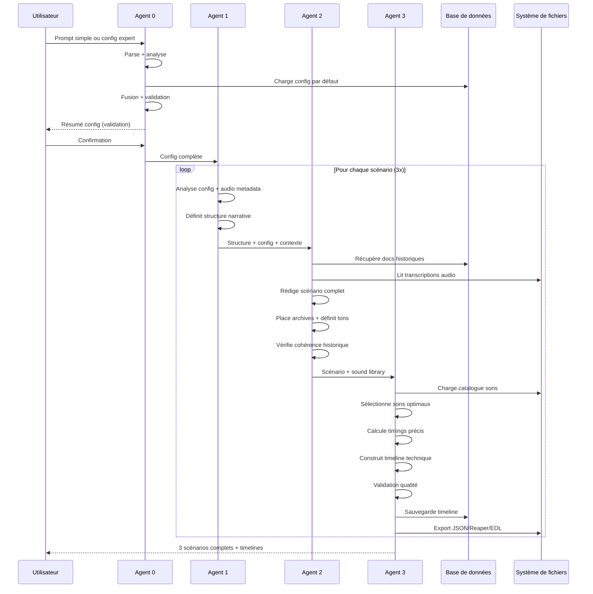

# 🤖 Documentation des Agents

> Architecture multi-agents pour la génération d'archives sonores historiques

Ce document détaille le rôle, les entrées, les sorties et le fonctionnement de chaque agent du système.

> **Note sur les exemples** : Les exemples fournis dans cette documentation utilisent le cas d'étude d'une grève de dockers en 1905. Il s'agit d'un exemple illustratif parmi d'autres. Le système est **générique** et s'applique à n'importe quel territoire, période ou thématique historique.

---

## Table des Matières

- [Vue d'ensemble](#vue-densemble)
- [Agent 0 : Request Parser](#agent-0--request-parser--config-builder)
- [Agent 1 : Narrative Structure Architect](#agent-1--narrative-structure-architect)
- [Agent 2 : Historical Scenario Writer](#agent-2--historical-scenario-writer)
- [Agent 3 : Audio Production Engineer](#agent-3--audio-production-engineer)
- [Pipeline complet](#pipeline-complet)
- [Gestion des erreurs](#gestion-des-erreurs)

---

## Vue d'ensemble

Le système utilise une architecture **séquentielle à 4 agents** où chaque agent enrichit progressivement le contenu :

```
┌─────────────┐     ┌─────────────┐     ┌─────────────┐     ┌─────────────┐
│   Agent 0   │────▶│   Agent 1   │────▶│   Agent 2   │────▶│   Agent 3   │
│  Parser     │     │  Structure  │     │   Writing   │     │  Production │
└─────────────┘     └─────────────┘     └─────────────┘     └─────────────┘
     Config            Structures          Scénarios          Timelines
```

### Spécialisation par agent

| Agent | Type de tâche | Modèle Claude | Température | Durée typique |
|-------|---------------|---------------|-------------|---------------|
| Agent 0 | Analytique | Sonnet 4.5 | 0.1 | ~5-10s |
| Agent 1 | Créative/Stratégique | Sonnet 4.5 | 0.7 | ~15-30s |
| Agent 2 | Créative/Narrative | Opus 4.5 | 0.8 | ~45-90s |
| Agent 3 | Technique/Analytique | Sonnet 4.5 + Python | 0.3 | ~20-40s |

---

## Agent 0 : Request Parser & Config Builder

### 🎯 Rôle

**Agent d'interface** entre l'utilisateur et le système. Il interprète la demande (simple ou expert) et construit une configuration complète et cohérente pour les agents suivants.

### 📥 Entrées

#### Mode Simple
```python
{
  "user_input": "Créez un documentaire de 4 minutes sur la grève des dockers de 1905. Ton dramatique, pour des lycéens.",
  "mode": "simple"
}
```

#### Mode Expert
```python
{
  "user_input": {
    "forme": "podcast_narratif",
    "duree": 300,
    "ton": "intimiste_confidentiel",
    "axe_narratif": "travailleur",
    "nombre_scenarios": 3,
    "public_cible": "grand_public"
  },
  "mode": "expert"
}
```

### 📤 Sorties

Configuration JSON complète avec **tous les paramètres** nécessaires aux agents suivants :

```json
{
  "scenario_config": {
    "metadata": {
      "config_version": "1.0",
      "creation_date": "2026-01-28T14:30:00",
      "user_mode": "simple"
    },
    
    "generation_parameters": {
      "forme": {
        "value": "documentaire",
        "user_specified": true
      },
      "duree": {
        "value": 240,
        "unit": "secondes",
        "user_specified": true
      },
      "ton": {
        "value": "dramatique_immersif",
        "intensity": 0.8,
        "user_specified": true
      },
      "nombre_scenarios": {
        "value": 3,
        "user_specified": false
      },
      "public_cible": {
        "value": "scolaire_secondaire",
        "user_specified": true
      },
      "axe_narratif": {
        "value": "mixte",
        "distribution": {
          "scenario_1": "travailleur",
          "scenario_2": "objet_lieu",
          "scenario_3": "contexte_social"
        },
        "user_specified": false
      }
    },
    
    "historical_context": {
      "period": {
        "start_year": 1900,
        "end_year": 1910
      },
      "location": {
        "primary": "Zone portuaire",
        "specific_areas": ["Quai principal"]
      },
      "themes": {
        "primary": ["grèves", "mouvements_sociaux", "conditions_travail"],
        "secondary": ["syndicalisme", "industrialisation"]
      }
    },
    
    "data_sources": {
      "user_provided": {
        "documents": [],
        "audio_files": [],
        "urls": []
      },
      "validated_sources": {
        "enabled": true,
        "sources": [...]
      }
    },
    
    "technical_parameters": {
      "model_temperature": {
        "agent_1_structure": 0.7,
        "agent_2_writing": 0.8,
        "agent_3_production": 0.3
      }
    }
  }
}
```

### ⚙️ Fonctionnement

1. **Chargement de la config par défaut**
   ```python
   with open('config/default_config.json') as f:
       config = json.load(f)
   ```

2. **Extraction des paramètres (Mode Simple)**
   - Utilise Claude pour analyser le prompt en langage naturel
   - Identifie les paramètres mentionnés explicitement ou implicitement
   - Marque `user_specified: true` pour les champs extraits

3. **Fusion (Mode Expert)**
   - Fusionne les champs fournis avec les valeurs par défaut
   - Marque tous les champs fournis comme `user_specified: true`

4. **Validation et normalisation**
   - Vérifie les contraintes (durée min/max, cohérence des paramètres)
   - Ajuste automatiquement les incompatibilités (ex: ton pédagogique pour enfants)
   - Génère les distributions d'axes narratifs si mode "mixte"

5. **Génération du résumé**
   - Crée un résumé lisible pour validation humaine
   - Liste les champs spécifiés par l'utilisateur

### 🔧 Paramètres Claude

```python
model = "anthropic/claude-sonnet-4-5"
temperature = 0.1  # Très bas pour précision d'extraction
max_tokens = 6000
```

### 📊 Exemples d'extraction

#### Exemple 1 : Extraction simple
```
Input : "Un conte de 5 minutes pour enfants sur les marins"

Extrait :
- forme: "conte"
- duree: 300
- public_cible: "enfants"
- themes: ["marins", "navigation"]
- ton: "pedagogique_accessible" (auto-ajusté)
```

#### Exemple 2 : Extraction contextuelle
```
Input : "Documentaire dramatique sur la grève de 1905"

Extrait :
- forme: "documentaire"
- ton: "dramatique_immersif"
- period: {"start_year": 1900, "end_year": 1910}
- themes: ["grèves", "mouvements_sociaux"]
- key_events: ["grève dockers 1905"]
```

### ⚠️ Gestion des erreurs

```python
try:
    extracted_config = json.loads(response.content[0].text)
    config = deep_merge(config, extracted_config)
except json.JSONDecodeError:
    logger.warning("Could not parse extraction. Using defaults.")
    # Continuer avec les valeurs par défaut
```

---

## Agent 1 : Narrative Structure Architect

### 🎯 Rôle

**Architecte de la structure narrative**. Définit la structure en parties, l'arc émotionnel, le rythme et les éléments nécessaires pour chaque scénario.

### 📥 Entrées

```python
{
  "config": {
    # Configuration complète de l'Agent 0
  },
  "audio_metadata": [
    {
      "file": "docker_interview_1950.wav",
      "duration": 127.5,
      "type": "testimony",
      "period": "1905",
      "themes": ["conditions_travail", "grève"]
    }
  ]
}
```

### 📤 Sorties

Pour **chaque scénario**, une structure détaillée :

```json
{
  "scenario_id": 1,
  "titre_global": "Voix du quai - Le docker Pierre Moreau",
  "axe_narratif": "travailleur",
  "duree_totale": 240,
  
  "structure": [
    {
      "partie": 1,
      "titre": "L'aube grise sur le port",
      "duree_cible": 45,
      "fonction_narrative": "introduction",
      "position_arc_emotionnel": "calme_initial",
      "elements_necessaires": [
        "ambiance_matinale",
        "sons_port_reveille",
        "voix_narrative_posee"
      ],
      "mood": "contemplatif"
    },
    {
      "partie": 2,
      "titre": "Les mains calleuses",
      "duree_cible": 60,
      "fonction_narrative": "presentation_personnage",
      "position_arc_emotionnel": "montee_empathie",
      "elements_necessaires": [
        "archive_temoignage_docker",
        "ambiance_travail_dur",
        "bruits_cargaison"
      ],
      "mood": "intimiste"
    },
    {
      "partie": 3,
      "titre": "La colère gronde",
      "duree_cible": 75,
      "fonction_narrative": "climax",
      "position_arc_emotionnel": "tension_maximale",
      "elements_necessaires": [
        "foule_agitee",
        "discours_syndical",
        "tension_croissante"
      ],
      "mood": "dramatique"
    },
    {
      "partie": 4,
      "titre": "Solidarité",
      "duree_cible": 60,
      "fonction_narrative": "resolution",
      "position_arc_emotionnel": "apaisement_determination",
      "elements_necessaires": [
        "chant_ouvrier",
        "ambiance_rassemblement",
        "note_espoir"
      ],
      "mood": "solennel_hopeful"
    }
  ],
  
  "arc_emotionnel_global": "calme → empathie → tension → résolution",
  "rythme_general": "lent au début, accélération progressive, ralentissement final",
  
  "transitions_cles": [
    {
      "entre_parties": [1, 2],
      "type": "fade_crossfade",
      "duree": 3,
      "description": "Transition douce du calme à l'activité"
    },
    {
      "entre_parties": [2, 3],
      "type": "cut_brutal",
      "description": "Rupture marquant l'escalade"
    }
  ],
  
  "notes_production": "Privilégier les silences narratifs dans la partie 1. Monter l'intensité sonore progressivement jusqu'à la partie 3."
}
```

### ⚙️ Fonctionnement

1. **Analyse de la configuration**
   - Comprend la durée totale cible
   - Identifie l'axe narratif assigné (travailleur, lieu, événement...)
   - Note le ton et le public cible

2. **Détermination du nombre de parties**
   - Durée < 2min : 2-3 parties
   - Durée 2-5min : 3-5 parties
   - Durée > 5min : 5-7 parties

3. **Répartition des durées**
   - Introduction : ~20% du temps
   - Développement : ~50-60%
   - Climax : ~15-20%
   - Résolution : ~10-15%

4. **Définition de l'arc émotionnel**
   - Adapté au ton demandé (dramatique = forte montée, contemplatif = courbe douce)
   - Placement du climax selon la structure narrative choisie

5. **Identification des éléments nécessaires**
   - Quels fichiers audio fournis vont où
   - Quels types d'ambiances sont requis
   - Besoins en narration vs archives

### 🔧 Paramètres Claude

```python
model = "anthropic/claude-sonnet-4-5"
temperature = 0.7  # Créativité modérée
max_tokens = 3000
```

### 📊 Logique de décision

```
SI public_cible == "enfants" ET duree > 180:
    → Diviser en plus de parties courtes (attention limitée)

SI ton == "dramatique" ET axe == "travailleur":
    → Arc émotionnel avec forte montée au climax

SI structure_narrative == "flashback":
    → Partie 1 = présent, Partie 2 = retour arrière, Partie 3+ = alternance

SI densite_sonore == "minimaliste":
    → Moins d'éléments nécessaires par partie
```

### ⚠️ Contraintes

- La somme des `duree_cible` doit être ≈ durée totale (±10%)
- Au moins 2 parties, maximum 7 parties
- Au moins une partie doit inclure des archives audio si fournies
- Le climax émotionnel doit être entre 60% et 80% du scénario

---

## Agent 2 : Historical Scenario Writer

### 🎯 Rôle

**Scénariste historique**. Écrit le texte narratif complet, place les archives audio aux moments pertinents, définit le ton précis de chaque segment et assure la rigueur historique.

### 📥 Entrées

```python
{
  "structure": {
    # Structure complète de l'Agent 1
  },
  "config": {
    # Configuration complète
  },
  "historical_context": {
    "documents": [
      {
        "source": "Archives Municipales",
        "title": "Registre des grèves 1900-1910",
        "content": "Le 3 février 1905, 247 dockers du quai principal...",
        "credibility": "high"
      }
    ],
    "period_details": {...},
    "key_figures": [...],
    "vocabulary": ["amarrer", "fret", "cale", "patron", "syndicat"]
  },
  "audio_transcriptions": [
    {
      "file": "docker_interview_1950.wav",
      "text": "J'avais 18 ans en 1905. On travaillait 12 heures par jour...",
      "segments": [
        {"start": 0.0, "end": 5.2, "text": "J'avais 18 ans en 1905."},
        {"start": 5.2, "end": 12.8, "text": "On travaillait 12 heures par jour, pour une misère."}
      ]
    }
  ],
  "available_sounds": [
    {
      "file": "port_aube_brume.wav",
      "tags": ["ambiance", "matin", "maritime"],
      "duration": 120,
      "period": "1900s"
    }
  ]
}
```

### 📤 Sorties

Scénario complet avec texte, placement audio et directions de ton :

```json
{
  "scenario_id": 1,
  "titre": "Voix du quai - Le docker Pierre Moreau",
  "axe_narratif": "travailleur",
  "duree_estimee": 238,
  
  "parties": [
    {
      "partie_id": 1,
      "titre": "L'aube grise sur le port",
      "duree": 45,
      
      "texte_narration": "En ce matin de février 1905, le port s'éveille dans la brume. Les pavés du quai principal luisent sous une pluie fine. Bientôt, deux cent quarante-sept hommes vont prendre une décision qui changera leur vie.",
      
      "ton": {
        "global": "contemplatif",
        "tempo_lecture": 110,
        "pauses": ["après 'brume' (2s)", "après 'fine' (1.5s)"],
        "intonation": "douce, posée, presque murmurée"
      },
      
      "moments_cles": [
        {
          "timestamp": "00:00-00:15",
          "action": "narration_intro",
          "ton_specifique": "doux, mystérieux",
          "volume_narration": 0.8
        },
        {
          "timestamp": "00:15-00:30",
          "action": "montee_ambiance",
          "consigne": "Introduire progressivement les sons du port qui s'éveille",
          "sons_suggeres": ["mouettes_lointaines", "clapotis", "pas_sur_paves"]
        },
        {
          "timestamp": "00:30-00:45",
          "action": "transition_narrative",
          "texte": "Des silhouettes apparaissent dans le brouillard.",
          "ton_specifique": "anticipation"
        }
      ],
      
      "transition_vers_partie_2": {
        "type": "fade_crossfade",
        "duree": 3,
        "description": "Le calme laisse place à l'activité. Sons de travail qui commencent."
      }
    },
    
    {
      "partie_id": 2,
      "titre": "Les mains calleuses",
      "duree": 62,
      
      "texte_narration": "Pierre Moreau a vingt ans. Ses mains portent déjà les marques de cinq années de labeur sur ces quais. Chaque jour, douze heures durant, il charge et décharge les navires. Le dos courbé, les muscles tendus, pour un salaire qui suffit à peine à nourrir sa famille.",
      
      "ton": {
        "global": "intimiste",
        "tempo_lecture": 100,
        "intensite_emotionnelle": 0.7
      },
      
      "moments_cles": [
        {
          "timestamp": "00:45-01:15",
          "action": "narration_persona",
          "ton_specifique": "empathique, proche"
        },
        {
          "timestamp": "01:15-01:30",
          "action": "archive_audio",
          "fichier": "docker_interview_1950.wav",
          "segment": {"start": 5.2, "end": 12.8},
          "texte_archive": "On travaillait 12 heures par jour, pour une misère.",
          "fade_in": 2,
          "fade_out": 2,
          "volume": 0.85,
          "processing": ["vintage_filter", "light_compression"],
          "justification_narrative": "Donne une voix authentique aux travailleurs. Le témoignage direct renforce l'empathie.",
          "contexte": "Enregistrement réalisé en 1950 avec un ancien docker qui avait 18 ans lors de la grève de 1905"
        },
        {
          "timestamp": "01:30-01:47",
          "action": "narration_contextualisation",
          "texte": "Ces mots résonnent encore aujourd'hui. En 1905, les conditions des dockers nantais étaient parmi les plus dures de France.",
          "ton_specifique": "grave, factuel"
        }
      ],
      
      "ambiances_continues": [
        {
          "son": "travail_docker_ambiance.wav",
          "start": "00:45",
          "end": "01:47",
          "volume": 0.3,
          "description": "Sons de caisses déplacées, cordes, grincements"
        }
      ]
    },
    
    {
      "partie_id": 3,
      "titre": "La colère gronde",
      "duree": 78,
      
      "texte_narration": "Le 3 février 1905, c'en est trop. Lorsque le patron annonce une nouvelle baisse des salaires, la colère explose. Sur les quais, les voix s'élèvent. D'abord quelques-uns, puis des dizaines, puis tous ensemble. 'On ne peut pas continuer comme ça !' crie quelqu'un. Un autre répond : 'La grève ! C'est la seule solution !' Le syndicat, encore jeune, trouve soudain des centaines d'adhérents. Pierre Moreau serre les poings. Il sait ce que cela signifie : pas de travail, pas de salaire. Peut-être pendant des semaines. Mais continuer à subir ? Impossible.",
      
      "ton": {
        "global": "dramatique",
        "tempo_lecture": 130,
        "intensite_emotionnelle": 0.95,
        "crescendo": "progressif du calme à l'emportement"
      },
      
      "moments_cles": [
        {
          "timestamp": "01:47-02:15",
          "action": "narration_buildup",
          "ton_specifique": "tension croissante"
        },
        {
          "timestamp": "02:15-02:45",
          "action": "peak_emotionnel",
          "texte": "'On ne peut pas continuer comme ça !' [...] 'La grève ! C'est la seule solution !'",
          "ton_specifique": "urgence, colère contenue",
          "volume_narration": 0.9
        },
        {
          "timestamp": "02:45-03:05",
          "action": "ambiance_foule",
          "sons": ["foule_agitee.wav", "cris_distance.wav"],
          "volume": 0.6,
          "description": "Montée sonore progressive, foule qui gronde"
        }
      ]
    },
    
    {
      "partie_id": 4,
      "titre": "Solidarité",
      "duree": 53,
      
      "texte_narration": "Dans les jours qui suivent, la solidarité s'organise. Les familles partagent le peu qu'elles ont. On se réunit pour tenir bon. Parfois, le soir, des chants s'élèvent. Des chants de lutte, mais aussi d'espoir. Pierre Moreau ne sait pas encore que cette grève durera trois semaines. Il ne sait pas qu'elle marquera le début d'un mouvement qui changera lentement, très lentement, les conditions de vie des dockers. Mais ce matin-là, sur les quais, il sait une chose : il n'est plus seul.",
      
      "ton": {
        "global": "solennel_hopeful",
        "tempo_lecture": 105,
        "intensite_emotionnelle": 0.6,
        "direction": "resolution apaisée mais déterminée"
      },
      
      "moments_cles": [
        {
          "timestamp": "03:05-03:35",
          "action": "narration_resolution",
          "ton_specifique": "apaisant, porteur d'espoir"
        },
        {
          "timestamp": "03:35-03:50",
          "action": "chant_ouvrier",
          "fichier": "chant_international_lointain.wav",
          "volume": 0.4,
          "fade_in": 5,
          "description": "Chant ouvrier à distance, symbolique"
        },
        {
          "timestamp": "03:50-03:58",
          "action": "narration_conclusion",
          "texte": "Il n'est plus seul.",
          "ton_specifique": "affirmation calme",
          "volume_narration": 0.7,
          "pause_finale": 3
        }
      ]
    }
  ],
  
  "metadata": {
    "nombre_mots": 387,
    "duree_lecture_estimee": 208,
    "nombre_archives_utilisees": 1,
    "nombre_ambiances": 8,
    "coherence_historique": {
      "accuracy_score": 0.95,
      "sources_citees": [
        "Archives Municipales - Registre des grèves",
        "Témoignage oral docker 1950"
      ],
      "verifications": [
        "Date grève : 3 février 1905 ✓",
        "Nombre de grévistes : 247 ✓",
        "Localisation : Quai principal ✓",
        "Durée grève : 3 semaines ✓"
      ],
      "vocabulaire_epoque": [
        "fret", "cale", "patron", "syndicat", "labeur"
      ]
    }
  },
  
  "notes_pour_agent_3": [
    "Privilégier les silences dans partie 1",
    "Partie 3 nécessite montée progressive du volume ambiant",
    "Chant final doit rester subtil, symbolique, pas envahissant"
  ]
}
```

### ⚙️ Fonctionnement

1. **Immersion dans le contexte historique**
   - Lecture complète des documents d'archives
   - Analyse des transcriptions audio fournies
   - Identification du vocabulaire d'époque

2. **Rédaction du texte narratif**
   - Respecte la structure de l'Agent 1
   - Utilise un français adapté à l'époque (authentique ou modernisé selon config)
   - Intègre naturellement les informations historiques

3. **Placement des archives audio**
   - Identifie les moments narratifs où une archive renforce l'impact
   - Justifie chaque placement (pourquoi ici ?)
   - Gère les transitions narration ↔ archive

4. **Définition du ton précis**
   - Pour chaque segment : ton, tempo, intensité
   - Marque les pauses et les variations d'intonation
   - Crée l'arc émotionnel défini par Agent 1

5. **Vérification historique**
   - Valide les dates, chiffres, noms
   - Liste les sources utilisées
   - Score d'exactitude historique

### 🔧 Paramètres Claude

```python
model = "anthropic/claude-opus-4-5"  # Opus pour qualité narrative maximale
temperature = 0.8  # Créativité élevée
max_tokens = 6000
system_prompt = "You are an expert historian and storyteller specializing in French maritime social history. You create emotionally engaging yet historically rigorous narratives."
```

### 📊 Contraintes d'écriture

**Authenticité linguistique** :
```python
if config['epoque_linguistique'] == 'authentique':
    → Utiliser : "fret", "amarrer", "cale", "labeur"
    → Éviter : "container", "boss", "travail"

if config['epoque_linguistique'] == 'modernise_accessible':
    → Utiliser : "cargaison", "travail", "patron"
    → Expliquer brièvement les termes techniques

if config['epoque_linguistique'] == 'mixte':
    → Utiliser le vocabulaire d'époque mais l'expliquer contextuellement
```

**Adaptation au public** :
```python
if config['public_cible'] == 'enfants':
    → Phrases courtes (max 15 mots)
    → Vocabulaire simple
    → Éviter les concepts abstraits

if config['public_cible'] == 'universitaire':
    → Détails historiques approfondis
    → Références bibliographiques
    → Nuances et débats historiographiques
```

**Gestion du tempo** :
```python
duree_lecture = nombre_mots / tempo_lecture_mots_par_minute * 60

Ajuster si :
    duree_lecture > duree_cible * 1.1 → Condenser
    duree_lecture < duree_cible * 0.9 → Développer
```

### ⚠️ Validation interne

Avant de retourner le scénario, Agent 2 vérifie :
- ✅ Durée totale ≈ durée cible (±10%)
- ✅ Toutes les archives fournies sont utilisées (sauf si non pertinentes)
- ✅ Pas d'anachronismes flagrants
- ✅ Arc émotionnel respecté
- ✅ Vocabulaire approprié au public cible

---

## Agent 3 : Audio Production Engineer

### 🎯 Rôle

**Ingénieur de production audio**. Transforme le scénario en une timeline technique précise, prête pour la production audio finale. Sélectionne les sons optimaux, calcule les timings à la milliseconde et définit tous les paramètres audio.

### 📥 Entrées

```python
{
  "scenario": {
    # Scénario complet de l'Agent 2
  },
  "sound_library": {
    "catalog": [
      {
        "file": "port_aube_brume.wav",
        "duration": 120.5,
        "tags": ["ambiance", "matin", "maritime", "calme"],
        "period": "1900s",
        "intensity": "low",
        "loop_friendly": true,
        "sample_rate": 48000,
        "bit_depth": 24
      },
      {
        "file": "docker_travail_caisses.wav",
        "duration": 45.2,
        "tags": ["travail", "docker", "caisses", "effort"],
        "period": "early_1900s",
        "intensity": "medium",
        "loop_friendly": true
      }
    ]
  },
  "config": {
    "audio_specifications": {
      "format": "WAV",
      "sample_rate": 48000,
      "bit_depth": 24,
      "channels": "stereo",
      "loudness_target": -16,
      "dynamic_range": "moderate"
    }
  }
}
```

### 📤 Sorties

Timeline technique complète prête pour la production :

```json
{
  "timeline_id": "scenario_1_timeline_v1",
  "scenario_id": 1,
  "duree_totale": 238.450,
  
  "tracks": {
    "narration_track": [
      {
        "id": "narr_01",
        "start_time": 0.0,
        "end_time": 15.234,
        "duration": 15.234,
        "text_file": "scenario_1_partie_1_narration.txt",
        "estimated_words": 42,
        "tempo_lecture": 110,
        "tone": "contemplatif",
        "voice_profile": {
          "gender": "male",
          "age_range": "45-55",
          "accent": "regional",
          "timbre": "grave",
          "delivery": "posee_douce"
        },
        "volume": 0.8,
        "effects": [],
        "pauses": [
          {"position": 7.2, "duration": 2.0, "context": "après 'brume'"},
          {"position": 13.8, "duration": 1.5, "context": "avant transition"}
        ]
      },
      {
        "id": "narr_02",
        "start_time": 45.5,
        "end_time": 75.8,
        "duration": 30.3,
        "text_file": "scenario_1_partie_2_narration.txt",
        "estimated_words": 78,
        "tempo_lecture": 100,
        "tone": "intimiste",
        "volume": 0.8,
        "effects": ["light_reverb"]
      }
    ],
    
    "archive_audio_track": [
      {
        "id": "arch_01",
        "start_time": 75.8,
        "end_time": 90.6,
        "duration": 14.8,
        "source_file": "docker_interview_1950.wav",
        "source_segment": {
          "start": 5.2,
          "end": 20.0
        },
        "volume": 0.85,
        "fade_in": 2.0,
        "fade_out": 2.0,
        "effects": [
          {
            "type": "eq",
            "parameters": {
              "low_cut": 80,
              "high_cut": 12000,
              "boost_mid": 3
            }
          },
          {
            "type": "vintage_filter",
            "preset": "1950s_recording"
          },
          {
            "type": "compression",
            "ratio": 2.5,
            "threshold": -18
          }
        ],
        "metadata": {
          "context": "Témoignage direct docker 1905",
          "justification": "Donne authenticité et voix humaine"
        }
      }
    ],
    
    "ambiance_background_track": [
      {
        "id": "amb_01",
        "start_time": 0.0,
        "end_time": 45.0,
        "duration": 45.0,
        "file": "port_aube_brume.wav",
        "file_duration": 120.5,
        "loop": false,
        "volume": 0.25,
        "fade_in": 5.0,
        "fade_out": 3.0,
        "pan": 0.0,
        "tags": ["ambiance", "matin", "maritime"]
      },
      {
        "id": "amb_02",
        "start_time": 42.0,
        "end_time": 167.0,
        "duration": 125.0,
        "file": "docker_travail_caisses.wav",
        "file_duration": 45.2,
        "loop": true,
        "loop_count": 3,
        "volume": 0.30,
        "fade_in": 3.0,
        "fade_out": 5.0,
        "pan": -0.2
      }
    ],
    
    "sound_effects_track": [
      {
        "id": "sfx_01",
        "start_time": 15.0,
        "duration": 2.5,
        "file": "mouettes_lointaines.wav",
        "volume": 0.4,
        "pan": 0.3,
        "fade_in": 0.5,
        "fade_out": 1.0
      },
      {
        "id": "sfx_02",
        "start_time": 30.2,
        "duration": 8.0,
        "file": "pas_sur_paves.wav",
        "volume": 0.35,
        "pan": -0.4,
        "movement": "left_to_right"
      },
      {
        "id": "sfx_03",
        "start_time": 167.0,
        "duration": 45.0,
        "file": "foule_agitee.wav",
        "volume": 0.60,
        "fade_in": 5.0,
        "fade_out": 3.0,
        "effects": ["crowd_spatializer"]
      }
    ],
    
    "music_motif_track": [
      {
        "id": "mus_01",
        "start_time": 210.0,
        "end_time": 238.45,
        "duration": 28.45,
        "file": "chant_international_lointain.wav",
        "volume": 0.40,
        "fade_in": 5.0,
        "fade_out": 5.0,
        "pan": 0.0,
        "note": "Symbolique, ne doit pas dominer"
      }
    ]
  },
  
  "transitions": [
    {
      "id": "trans_01",
      "type": "fade_crossfade",
      "start_time": 42.0,
      "duration": 3.0,
      "tracks_involved": ["amb_01", "amb_02"],
      "description": "Transition douce aube → activité portuaire"
    },
    {
      "id": "trans_02",
      "type": "cut_brutal",
      "time": 167.0,
      "description": "Rupture marquant escalade vers climax"
    }
  ],
  
  "master_parameters": {
    "target_loudness": -16.0,
    "dynamic_range": "moderate",
    "final_compression": {
      "enabled": true,
      "ratio": 2.0,
      "threshold": -12
    },
    "final_limiter": {
      "ceiling": -1.0,
      "release": 100
    }
  },
  
  "metadata": {
    "total_files_used": 12,
    "total_tracks": 5,
    "total_regions": 23,
    "generation_timestamp": "2026-01-28T15:45:00",
    "estimated_production_time": "2-3 heures",
    "required_software": ["Reaper", "Pro Tools", "Logic Pro"],
    "export_formats": ["json", "reaper_project", "edl"]
  },
  
  "quality_checks": {
    "timeline_coherence": "✓",
    "no_overlapping_conflicts": "✓",
    "duration_matches_scenario": "✓ (238.45s ≈ 240s cible)",
    "all_required_sounds_found": "✓",
    "volume_levels_balanced": "✓",
    "transitions_smooth": "✓"
  }
}
```

### ⚙️ Fonctionnement

1. **Analyse du scénario**
   - Parse chaque partie du scénario
   - Identifie tous les moments clés temporels
   - Calcule les durées précises de narration

2. **Sélection des sons optimaux**
   ```python
   def selectOptimalSound(required_tags, mood, period, duration_needed):
       candidates = sound_library.search(
           tags=required_tags,
           mood=mood,
           period=period
       )
       
       # Score de pertinence
       for sound in candidates:
           score = calculateRelevanceScore(
               tag_match=sound.tags_overlap(required_tags),
               mood_alignment=compareMood(sound.mood, mood),
               period_accuracy=checkPeriod(sound.period, period),
               duration_fit=evaluateDuration(sound.duration, duration_needed),
               audio_quality=sound.technical_quality
           )
       
       return max(candidates, key=lambda s: s.score)
   ```

3. **Calcul des timings précis**
   ```python
   def calculateNarrationDuration(text, tempo_wpm, pauses):
       # Durée brute
       word_count = len(text.split())
       base_duration = (word_count / tempo_wpm) * 60
       
       # Ajout des pauses
       total_pauses = sum(pause['duration'] for pause in pauses)
       
       # Ajustement respirations naturelles
       breathing_time = word_count * 0.05
       
       return base_duration + total_pauses + breathing_time
   ```

4. **Placement sur la timeline**
   - Création des tracks (narration, archives, ambiances, effets, musique)
   - Positionnement temporel précis de chaque élément
   - Calcul des crossfades et transitions

5. **Optimisation des volumes et balance**
   - Narration : toujours prioritaire (0.7-0.9)
   - Archives : volume respecté (0.8-0.9)
   - Ambiances : background (0.2-0.4)
   - Effets : accent (0.3-0.6)
   - Musique : subtile (0.3-0.5)

6. **Gestion des overlaps**
   ```python
   def resolveOverlaps(tracks):
       for track in tracks:
           for region1, region2 in findOverlaps(track):
               if canCoexist(region1, region2):
                   # Ajuster les volumes pour cohabitation
                   adjustVolumesForCoexistence(region1, region2)
               else:
                   # Créer une transition
                   createTransition(region1, region2, type="crossfade")
   ```

7. **Validation finale**
   - Durée totale respectée (±5%)
   - Pas de trous dans la timeline
   - Volumes équilibrés
   - Tous les fichiers existent

### 🔧 Paramètres Claude

```python
model = "anthropic/claude-sonnet-4-5"
temperature = 0.3  # Précision technique
max_tokens = 8000

# Mode hybride : Claude pour décisions créatives, Python pour calculs
use_python_tool = True  # Calculs de timing précis
```

### 📊 Algorithmes de sélection de sons

**Scoring de pertinence** :
```python
relevance_score = (
    tag_match_score * 0.30 +        # 30% : correspondance tags
    mood_alignment * 0.25 +          # 25% : cohérence mood
    period_accuracy * 0.20 +         # 20% : authenticité période
    audio_quality * 0.15 +           # 15% : qualité technique
    duration_fitness * 0.10          # 10% : durée adaptée
)
```

**Gestion des loops** :
```python
if sound.loop_friendly and duration_needed > sound.duration * 1.5:
    loop_count = ceil(duration_needed / sound.duration)
    apply_crossfade_loops(sound, loop_count)
```

### 🎚️ Mixing automatique

**Règles de priorité** :
```
SI narration active:
    → Ambiances: -6 dB (ducking)
    → Effets: -3 dB si proches spectralement

SI archive audio active:
    → Ambiances: -8 dB
    → Narration: pause

SI climax émotionnel:
    → Tous éléments: +2 dB (intensification)
    → Compression légèrement augmentée
```

### 🔄 Itérations et optimisation

L'Agent 3 peut proposer des alternatives :

```json
{
  "timeline_version": "v1",
  "alternatives": [
    {
      "version": "v1_minimal",
      "changes": "Densité sonore réduite (-40% d'éléments)",
      "use_case": "Public contemplatif, écoute attentive"
    },
    {
      "version": "v1_immersive",
      "changes": "Densité augmentée (+60% d'ambiances)",
      "use_case": "Exposition immersive, casque audio"
    }
  ]
}
```

### ⚠️ Contraintes techniques

- ✅ Aucun overlap sur le track narration (voix unique)
- ✅ Maximum 4 ambiances simultanées (clarté auditive)
- ✅ Transitions toujours > 0.5s (éviter les clicks)
- ✅ Volumes normalisés entre -24 dB et -6 dB avant mastering
- ✅ Silence minimum de 0.5s entre deux narrations
- ✅ Archives toujours contextualisées (narration avant/après)

### 📤 Formats d'export

**JSON** : Format natif complet

**Reaper Project** : 
```python
def exportToReaper(timeline):
    project = ReaperProject()
    for track_name, regions in timeline['tracks'].items():
        track = project.addTrack(name=track_name)
        for region in regions:
            item = track.addMediaItem(
                file=region['file'],
                position=region['start_time'],
                length=region['duration'],
                volume=region['volume']
            )
            applyEffects(item, region.get('effects', []))
    return project.save()
```

**EDL (Edit Decision List)** :
```
TITLE: Scenario_1_Voix_du_quai
001  AUD  C        00:00:00:00 00:00:15:14 00:00:00:00 00:00:15:14
     * FROM CLIP: port_aube_brume.wav
002  AUD  C        00:00:15:14 00:00:18:08 00:00:15:14 00:00:18:08
     * FROM CLIP: mouettes_lointaines.wav
```

---

## Pipeline complet

### 🔄 Flux de données



### ⏱️ Temps d'exécution typique

| Étape | Durée | Dépend de |
|-------|-------|-----------|
| **Agent 0** : Config | 5-10s | Complexité du prompt |
| **Agent 1** : Structure (×3) | 15-30s | Nombre de parties |
| **Agent 2** : Writing (×3) | 45-90s | Durée cible, détail historique |
| **Agent 3** : Production (×3) | 20-40s | Taille sound library |
| **TOTAL** | **2-4 min** | Pour 3 scénarios de 2-4 min chacun |

### 💰 Coût estimé (API)

**Avec OpenRouter** :
- Agent 0 : ~$0.02
- Agent 1 (×3) : ~$0.15
- Agent 2 (×3) : ~$0.60 (Opus)
- Agent 3 (×3) : ~$0.18

**Total par génération** : **~$0.95** (3 scénarios complets)

### 📊 Données transitant entre agents

```
Agent 0 → Agent 1 : 
  - Config JSON (~15 KB)
  - Metadata audio (~2 KB)
  
Agent 1 → Agent 2 :
  - Structures (×3) (~30 KB)
  - Config complète (~15 KB)
  - Contexte historique (~50 KB)
  - Transcriptions (~20 KB)
  
Agent 2 → Agent 3 :
  - Scénarios (×3) (~150 KB)
  - Config (~15 KB)
  - Sound library catalog (~100 KB)
  
Agent 3 → Output :
  - Timelines (×3) (~200 KB)
  - Exports multiples (JSON, Reaper, EDL) (~300 KB)
```

### 🔁 Boucles de rétroaction

```python
def pipeline_avec_validation(user_input, mode):
    # Agent 0
    config = agent_0.parse(user_input, mode)
    if not user_validates(config):
        config = agent_0.refine(user_feedback)
    
    scenarios = []
    for i in range(config['nombre_scenarios']):
        # Agent 1
        structure = agent_1.create_structure(config, scenario_num=i)
        
        # Agent 2
        scenario = agent_2.write_scenario(structure, config)
        
        # Validation historique
        if config['require_historical_validation']:
            accuracy = validate_historical_facts(scenario)
            if accuracy < 0.85:
                scenario = agent_2.refine_with_corrections(scenario, corrections)
        
        # Agent 3
        timeline = agent_3.create_timeline(scenario, config)
        
        # Validation technique
        if not timeline['quality_checks']['all_passed']:
            timeline = agent_3.fix_issues(timeline)
        
        scenarios.append({
            'structure': structure,
            'scenario': scenario,
            'timeline': timeline
        })
    
    return scenarios
```

---

## Gestion des erreurs

### 🚨 Types d'erreurs et stratégies

#### 1. Erreurs d'API (Claude)

```python
class APIErrorHandler:
    def handle_api_error(self, error, agent_name, attempt=1):
        if isinstance(error, RateLimitError):
            # Attente exponentielle
            wait_time = 2 ** attempt
            logger.warning(f"{agent_name}: Rate limit. Retry in {wait_time}s")
            time.sleep(wait_time)
            return "retry"
        
        elif isinstance(error, OverloadedError):
            # Serveur surchargé
            if attempt < 3:
                time.sleep(10)
                return "retry"
            else:
                return "fallback_to_default"
        
        elif isinstance(error, AuthenticationError):
            logger.error("Invalid API key")
            return "abort"
        
        elif isinstance(error, InvalidRequestError):
            logger.error(f"Invalid request: {error}")
            return "fix_request"
        
        else:
            logger.error(f"Unknown error: {error}")
            return "retry_or_abort"
```

#### 2. Erreurs de parsing JSON

```python
def safe_json_parse(response_text, agent_name):
    try:
        return json.loads(response_text)
    except json.JSONDecodeError as e:
        logger.warning(f"{agent_name}: JSON parse error at position {e.pos}")
        
        # Tentative de récupération
        try:
            # Nettoyer markdown
            cleaned = response_text.strip()
            if cleaned.startswith("```json"):
                cleaned = cleaned[7:]
            if cleaned.endswith("```"):
                cleaned = cleaned[:-3]
            
            return json.loads(cleaned.strip())
        except:
            logger.error(f"{agent_name}: Cannot recover JSON")
            return None
```

#### 3. Erreurs de fichiers manquants

```python
class SoundLibraryHandler:
    def get_sound_file(self, filename, fallback=True):
        filepath = os.path.join(SOUND_LIBRARY_PATH, filename)
        
        if os.path.exists(filepath):
            return filepath
        
        if fallback:
            # Recherche par tags similaires
            similar = self.find_similar_sound(filename)
            if similar:
                logger.warning(f"Using fallback: {similar} instead of {filename}")
                return similar
            
            # Son générique par catégorie
            category = self.extract_category(filename)
            generic = self.get_generic_sound(category)
            logger.warning(f"Using generic sound for category: {category}")
            return generic
        
        raise FileNotFoundError(f"Sound file not found: {filename}")
```

#### 4. Erreurs de cohérence historique

```python
def validate_historical_scenario(scenario, config):
    errors = []
    warnings = []
    
    # Vérifier dates
    for date_mention in extract_dates(scenario['texte']):
        if not is_date_in_period(date_mention, config['period']):
            errors.append(f"Date hors période: {date_mention}")
    
    # Vérifier vocabulaire anachronique
    anachronisms = detect_anachronisms(
        scenario['texte'], 
        config['period']['start_year']
    )
    if anachronisms:
        warnings.extend([f"Anachronisme possible: {word}" for word in anachronisms])
    
    # Vérifier cohérence lieux
    for location in extract_locations(scenario['texte']):
        if not verify_location_exists(location, config['period']):
            errors.append(f"Lieu invalide pour la période: {location}")
    
    return {
        'valid': len(errors) == 0,
        'errors': errors,
        'warnings': warnings,
        'accuracy_score': calculate_accuracy_score(errors, warnings)
    }
```

#### 5. Erreurs de durée (timeline)

```python
def fix_duration_mismatch(timeline, target_duration, tolerance=0.10):
    actual = timeline['duree_totale']
    target = target_duration
    
    if abs(actual - target) / target <= tolerance:
        return timeline  # OK
    
    if actual > target:
        # Trop long : compression
        ratio = target / actual
        logger.info(f"Compressing timeline by {ratio:.2%}")
        
        for track in timeline['tracks'].values():
            for region in track:
                # Réduire durées proportionnellement
                region['duration'] *= ratio
                region['end_time'] = region['start_time'] + region['duration']
                
                # Ajuster tempo narration
                if 'tempo_lecture' in region:
                    region['tempo_lecture'] /= ratio
    
    else:
        # Trop court : expansion
        ratio = target / actual
        logger.info(f"Expanding timeline by {ratio:.2%}")
        
        # Ajouter des pauses ou étendre ambiances
        extend_ambient_sounds(timeline, ratio)
        add_breathing_pauses(timeline, ratio)
    
    return timeline
```

### 🛡️ Stratégies de fallback

| Situation | Stratégie | Impact qualité |
|-----------|-----------|----------------|
| API Claude indisponible | Utiliser config par défaut + templates | Moyen (-30%) |
| Fichier son manquant | Son similaire ou générique | Faible (-10%) |
| Erreur historique grave | Re-génération avec contraintes renforcées | Nul (itération) |
| Parsing JSON échoué | Nettoyer + réessayer, sinon valeurs par défaut | Moyen (-20%) |
| Timeout Agent 2 | Scénario plus court avec structure simplifiée | Moyen (-25%) |
| Sound library vide | Génération sans ambiances (narration uniquement) | Élevé (-50%) |

### 📝 Logging et monitoring

```python
import logging
from datetime import datetime

class AgentLogger:
    def __init__(self, agent_name):
        self.agent_name = agent_name
        self.logger = logging.getLogger(agent_name)
        
    def log_start(self, task, inputs):
        self.logger.info(f"[{self.agent_name}] START: {task}")
        self.logger.debug(f"Inputs: {inputs}")
        self.start_time = datetime.now()
    
    def log_end(self, task, outputs, status="success"):
        duration = (datetime.now() - self.start_time).total_seconds()
        self.logger.info(f"[{self.agent_name}] END: {task} ({duration:.2f}s) - {status}")
        
        if status == "error":
            self.logger.error(f"Error details: {outputs}")
        else:
            self.logger.debug(f"Outputs: {outputs}")
        
        # Métriques
        self.record_metric(task, duration, status)
    
    def record_metric(self, task, duration, status):
        # Envoyer vers système de monitoring (Prometheus, etc.)
        metrics_db.record({
            'agent': self.agent_name,
            'task': task,
            'duration': duration,
            'status': status,
            'timestamp': datetime.now()
        })
```

### 🔄 Retry avec backoff exponentiel

```python
def retry_with_backoff(func, max_attempts=3, base_delay=2):
    for attempt in range(1, max_attempts + 1):
        try:
            return func()
        except Exception as e:
            if attempt == max_attempts:
                logger.error(f"Failed after {max_attempts} attempts")
                raise
            
            delay = base_delay ** attempt
            logger.warning(f"Attempt {attempt} failed. Retry in {delay}s. Error: {e}")
            time.sleep(delay)
```

---

## 🎓 Conclusion

Ce système d'agents offre une solution complète et modulaire pour la génération d'archives sonores historiques de haute qualité. Chaque agent est spécialisé dans sa tâche, avec des modèles et températures optimisés pour son rôle spécifique.

### Points forts

✅ **Modularité** : Chaque agent peut être amélioré indépendamment  
✅ **Qualité** : Utilisation d'Opus pour l'écriture créative  
✅ **Rigueur** : Validation historique à chaque étape  
✅ **Flexibilité** : Mode simple et expert selon le besoin  
✅ **Robustesse** : Gestion complète des erreurs et fallbacks  

### Évolutions futures

🔮 **Agent 4** : Génération audio automatique (TTS + mixing)  
🔮 **Agent 5** : Validation collaborative (feedback humain intégré)  
🔮 **Optimisation** : Parallélisation des 3 scénarios  
🔮 **Intelligence** : Apprentissage des préférences utilisateur  

---

**Pour toute question sur un agent spécifique, consultez le code source dans le dossier `agents/`**