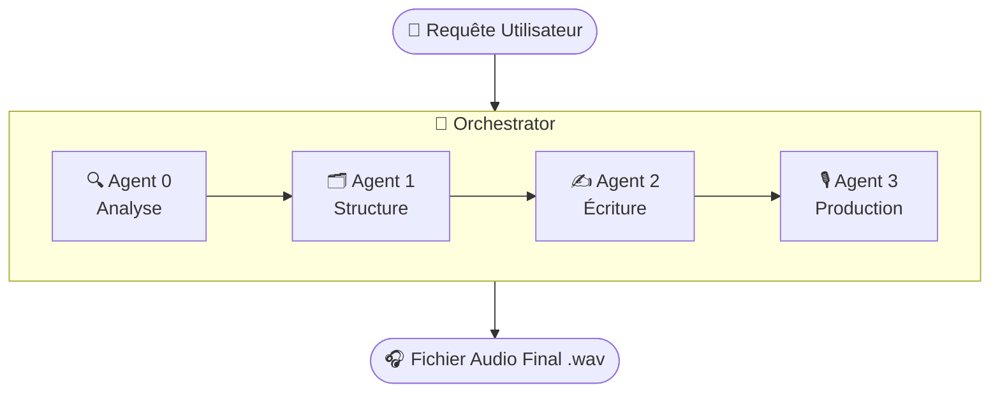

# Documentation Technique : Mémoire des Territoires

Ce document détaille le fonctionnement, l'architecture et les composants techniques de l'application "Mémoire des Territoires". Il est destiné à deux publics : les décideurs (pour une vue d'ensemble) et les développeurs (pour les détails d'implémentation).

---

## 🗺️ 1. Vue d'ensemble du projet

Mémoire des Territoires est un générateur automatique de récits sonores. À partir d'un simple thème ou d'une idée (par exemple, "l'ambiance des chantiers navals"), l'application imagine, écrit et produit une expérience audio complète. Elle combine une narration, des voix de personnages, des bruitages et une ambiance sonore pour créer une capsule temporelle immersive, comme un mini-documentaire ou une fiction radiophonique.

---

## ✨ 2. Ce que fait l'application

L'application transforme une demande utilisateur en un produit audio final à travers plusieurs étapes automatisées :

- **Analyse de la demande** : Elle décompose la requête initiale pour comprendre le sujet principal, les contraintes et les intentions.
- **Génération d'un scénario** : À partir du thème, elle élabore une structure narrative (un plan) puis rédige un véritable scénario avec des dialogues, des descriptions et des événements.
- **Création de l'univers sonore** : L'application sélectionne des sons d'ambiance (ex : le bruit d'un port), des bruitages spécifiques (ex : une sirène de bateau) et choisit des voix pour les personnages du récit.
- **Production finale** : Elle assemble tous ces éléments (narrations, dialogues, sons) sur une ligne temporelle audio pour produire le fichier son final au format `.wav`, prêt à être écouté.

---

## ⚙️ 3. Stack technique

| Domaine | Technologie | Rôle |
| :--- | :--- | :--- |
| **Backend** | Python 3.11+ | Langage principal pour toute la logique de génération. |
| | Google Gemini / OpenAI GPT | Modèles de langage pour l'analyse, la structuration et l'écriture. |
| | FastAPI | Framework pour exposer la logique via une API REST. |
| | librosa / soundfile | Chargement, manipulation et export des fichiers audio `.wav`. |
| **Frontend** | React (avec TypeScript) | Framework pour l'interface utilisateur web. |
| | Vite | Outil de build pour le développement frontend. |
| **Orchestration** | Python (`orchestrator.py`) | Script central qui coordonne les différents agents IA. |
| **Déploiement** | Docker | Conteneurisation de l'application pour un déploiement unifié. |
| **Gestion des dépendances** | uv / pip | Gestion des paquets Python. |
| | npm | Gestion des paquets JavaScript pour le frontend. |
| **Automatisation** | Makefile | Scripts pour simplifier les tâches courantes (installation, lancement). |

---

## 🏗️ 4. Architecture du projet

Le projet est organisé autour d'une architecture modulaire basée sur des "agents" spécialisés, coordonnés par un orchestrateur.

```
memoiredesterritoires/
├── agents/                    # Cœur logique de l'IA — chaque sous-dossier est un agent spécialisé
│   ├── agent_0_request_parser/
│   ├── agent_1_structure/
│   ├── agent_2_writing/
│   └── agent_3_production/
├── app/                       # Interface utilisateur (Frontend React)
├── skills/                    # Compétences réutilisables appelées par les agents
│   ├── audio_timeline_composer/
│   ├── ambiance_sound_selector/
│   └── narrative_scenario_builder/
├── config/                    # Fichiers de configuration (modèles IA, paramètres)
├── data/                      # Données brutes, bibliothèque audio et sessions de travail
├── output/                    # Fichiers générés : scénarios, structures, audio final
├── scripts/                   # Scripts utilitaires (ex : initialisation de la bibliothèque sonore)
├── utils/                     # Modules partagés (ex : wikipedia_fetcher.py)
├── orchestrator.py            # Le chef d'orchestre — exécute les agents dans l'ordre
├── main.py / cli.py           # Points d'entrée (mode API ou ligne de commande)
├── Dockerfile                 # Recette de build de l'image Docker
├── Makefile                   # Raccourcis de commandes
├── requirements.txt / pyproject.toml  # Dépendances Python
└── package.json               # Dépendances JavaScript (frontend)
```

---

## 🔄 5. Fonctionnement global

Le flux de travail principal est une chaîne de traitement séquentielle gérée par `orchestrator.py`.

1. **Requête** : L'utilisateur soumet une idée via l'interface web (ou un autre point d'entrée).
2. **Orchestration** : `orchestrator.py` reçoit la demande et la transmet au premier agent.
3. **Pipeline d'agents** :
   - L'**Agent 0 (`request_parser`)** analyse et structure la demande utilisateur.
   - L'**Agent 1 (`structure`)** crée le squelette narratif du récit.
   - L'**Agent 2 (`writing`)** prend ce squelette et rédige le scénario complet.
   - L'**Agent 3 (`production`)** utilise ce scénario pour assembler la piste audio, en s'appuyant sur les `skills` pour la composition sonore et la synthèse vocale.
4. **Résultat** : Chaque étape sauvegarde ses productions (structure JSON, scénario texte, audio `.wav`) dans le dossier `output/`.

Schéma du flux :



---

## 🔧 6. Installation et lancement

### Prérequis

- Python 3.11+
- Node.js & npm
- Docker (recommandé)
- `make` (disponible sur Linux/macOS ; sur Windows, utiliser Git Bash ou WSL)

### 1. Installation

```bash
# Installe les dépendances Python et JavaScript
make setup
```

Sans `make`, suivez les étapes manuelles :

```bash
# Dépendances backend
pip install -r requirements.txt

# Dépendances frontend
cd app
npm install
cd ..
```

### 2. Lancement du backend

```bash
make run-backend
```

> **Note** : La commande exacte peut varier. Consultez le `Makefile` ou `main.py` pour plus de détails.

### 3. Lancement du frontend

```bash
cd app
npm run dev
```

L'interface sera accessible dans votre navigateur à l'adresse `http://localhost:5173`.

### 4. Utilisation avec Docker

```bash
# Construire l'image
docker build -t memoire-des-territoires .

# Lancer le conteneur
docker run -p 8000:8000 -v ./output:/app/output memoire-des-territoires
```

> **Note** : Les ports et volumes peuvent nécessiter des ajustements selon la configuration de `main.py`.

---

## ✍️ Approfondissement : Génération des scénarios

### Explication simple

L'application confie la rédaction du scénario à un "agent écrivain". Cet agent reçoit un plan détaillé (créé à l'étape précédente) et des instructions claires : durée souhaitée, ton (ex : "nostalgique"), style d'écriture. Il utilise ensuite un grand modèle de langage (GPT ou Gemini) pour rédiger le texte, en se comportant comme un scénariste de documentaire audio.

### Détails techniques

- **Agent responsable** : `agents/agent_2_writing/writer.py`
- **Compétence (Skill)** : `skills/narrative_scenario_builder/`
- **Modèle LLM et prompt** : Le comportement du LLM est défini dans `agents/agent_2_writing/skill.md` :

```markdown
# Rôle : Scénariste pour documentaire audio

Tu es un scénariste expert, spécialisé dans la création de récits audio immersifs.
Ton objectif est de transformer la structure narrative fournie en un scénario complet et détaillé.
```

- **Paramètres d'influence** : Gérés par `agents/utils/user_constraints.py` et injectés dans le prompt :

```python
prompt_variables = {
    "structure": generated_structure,
    "duration_minutes": user_constraints.duration_minutes,
    "tone": user_constraints.tone,
    "style": user_constraints.style,
    "historical_context": context_from_previous_step
}

scenario = narrative_skill.execute(prompt_variables)
```

---

## 🌍 Approfondissement : Respect des informations historiques

### Explication simple

Avant d'écrire, l'application fait des recherches sur le sujet demandé, comme un journaliste consultant des archives. Les informations pertinentes sont extraites et fournies à l'agent écrivain comme un dossier documentaire. L'écrivain a pour consigne stricte de baser son récit sur ces faits et de ne rien inventer qui pourrait contredire la réalité historique.

### Détails techniques

- **Injection de données** : Le module `utils/wikipedia_fetcher.py` récupère du contenu textuel depuis Wikipedia durant l'étape de l'**Agent 1 (`structure`)**, pour que le contexte influence à la fois le plan et le scénario final.
- **Mécanisme de contrainte** : La fiabilité repose sur le **prompt engineering**. Le contexte historique est injecté directement dans le prompt avec des consignes strictes :

```markdown
**Contexte historique fourni :**
"""
{{ historical_context }}
"""

**Consignes strictes :**
- Tu DOIS te baser exclusivement sur le contexte historique fourni.
- NE PAS inventer de faits, de dates ou de personnages qui contrediraient ce contexte.
- Les éléments de fiction (dialogues, personnages non-historiques) doivent être plausibles
  et servir le récit sans altérer la vérité historique.
```

- **Traçabilité des sources** : Les URLs Wikipedia sont conservées dans les données de session (`data/sessions/`) pour permettre un contrôle manuel, même si elles ne figurent pas dans le fichier audio final.

---

## 🎧 Approfondissement : Choix et superposition des pistes audio

### Explication simple

L'application dispose d'une bibliothèque de sons classés par "tags" (ex : `mer`, `vent`, `moteur`). En lisant le scénario, elle identifie les ambiances et événements sonores nécessaires, sélectionne les fichiers `.wav` correspondants, génère les voix et assemble le tout comme un monteur son. Les volumes sont ajustés pour que la narration reste claire au-dessus de l'ambiance, et des fondus assurent des transitions fluides.

### Détails techniques

- **Sélection des pistes** : Gérée par `skills/ambiance_sound_selector/`, en lisant les annotations du scénario (ex : `[ambiance: bruit de port]`). Le script `scripts/init_sound_library.py` génère en amont un index JSON associant des tags aux fichiers `.wav`.

- **Mixage et superposition** :
  - **Librairie** : `librosa` (chargement et traitement) + `soundfile` (export), utilisées par `skills/audio_timeline_composer/`.
  - **Logique** : Les pistes sont chargées sous forme de tableaux NumPy, ajustées en volume, puis additionnées à la position temporelle souhaitée.

```python
import librosa
import numpy as np
import soundfile as sf

SR = 44100  # Fréquence d'échantillonnage

# Création d'une piste silencieuse
final_mix = np.zeros(int(total_duration_s * SR))

# Chargement et réduction du volume de l'ambiance (-10 dB ≈ ×0.316)
ambiance, _ = librosa.load("sounds/ambiance_port.wav", sr=SR)
final_mix[:len(ambiance)] += ambiance * 0.316

# Ajout de la narration à t=5s
narration, _ = librosa.load("output/voices/narration_part1.wav", sr=SR)
pos_5s = int(5 * SR)
final_mix[pos_5s:pos_5s + len(narration)] += narration

# Ajout d'un bruitage à t=8s avec fondu d'entrée
sirene, _ = librosa.load("sounds/sirene.wav", sr=SR)
fade_in = np.linspace(0, 1, int(SR))  # Fondu sur 1 seconde
sirene[:len(fade_in)] *= fade_in
pos_8s = int(8 * SR)
final_mix[pos_8s:pos_8s + len(sirene)] += sirene

# Export final
sf.write("output/scenarios/mon_recit_final.wav", final_mix, SR)
```

- **Format de sortie** :
  - **Format** : `.wav` (non compressé, sans perte)
  - **Canaux** : Stéréo
  - **Fréquence d'échantillonnage** : 44 100 Hz
  - **Profondeur de bits** : 16-bit ou 24-bit selon la configuration
